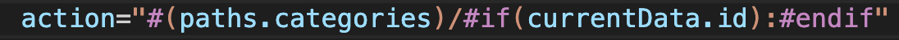

# Change Log

All notable changes to the "leaf" extension will be documented in this file.

## 0.0.1-0.0.2

Initial release

## 0.0.3-0.04

remove `number`, `invalid` detection out of tag.

## 0.0.5

fix bugs. Such as wrong highlighting of `in`.
add a syntax highlight for parameters in `if(...):`

## 0.0.6

fix bugs in issue [#1](https://github.com/chocoford/leaf-extension/issues/1).
Now syntax supports highlighting functions and variables used in a string.

