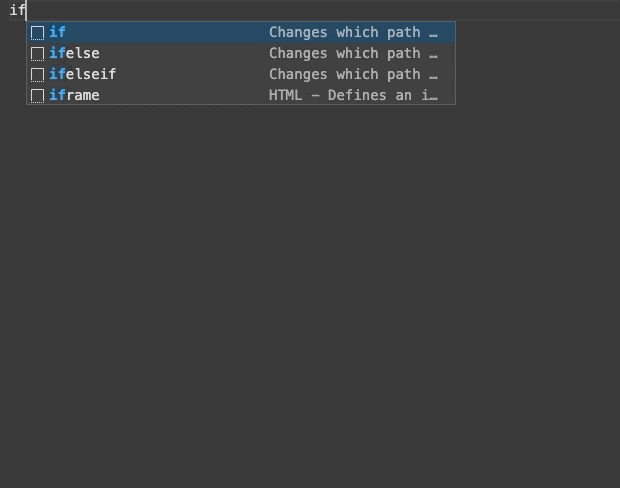

# leaf README

This Extension adds `HTML` and `Leaf` syntax highlighting and snippets for [.leaf🍃](https://github.com/vapor/leaf) files.

## Features

### Syntax highlighting

### Snippets

## Requirements

* Vapor4(beta)
* Leaf

## Release Notes

### 0.0.1

Initial release

## Bugs and Ideas?

* if you find a bug or have ideas, please let me know 🙃
* https://github.com/chocoford/leaf-extension